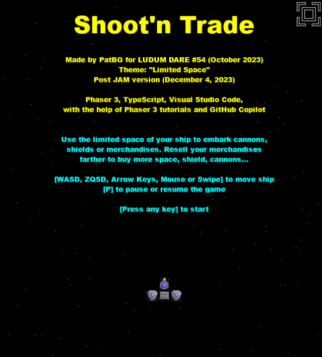
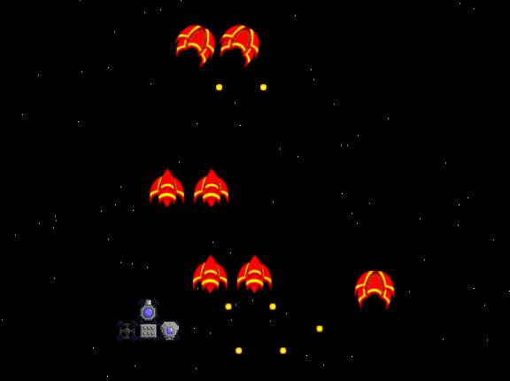
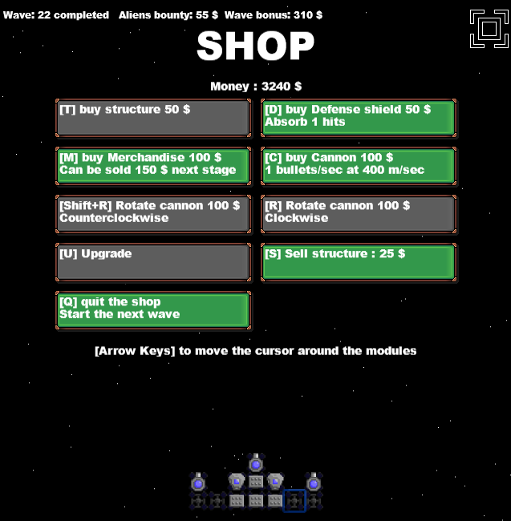

# Shoot'n Trade

This game was made by PatBG for LUDUM DARE #54 (October 2023) in "EXTRA" category  
Theme: "Limited Space"  
https://ldjam.com/events/ludum-dare/54/shootn-trade

Framework used: Phaser 3.60  
Language: TypeScript  
Tool: Visual Studio Code  
... with the help of Phaser 3 tutorials and GitHub Copilot

## Licence

The source code in this repo is released under the MIT license.  
The assets are not, look at licence file in "assets_sources" folder for more informations.

## Play instructions:

Use the limited space of your ship to embark cannons, shields or merchandises.  
Resell your merchandise after each wave to make profit and buy more space.

[Use arrow keys or mouse] to move ship  

**Play in your web browser at Itch.io**: https://patbgames.itch.io/ld54-shoot-n-trade

 

 

 

